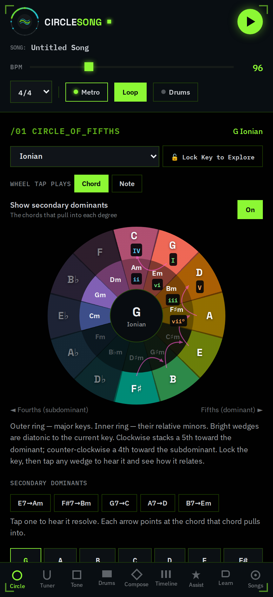
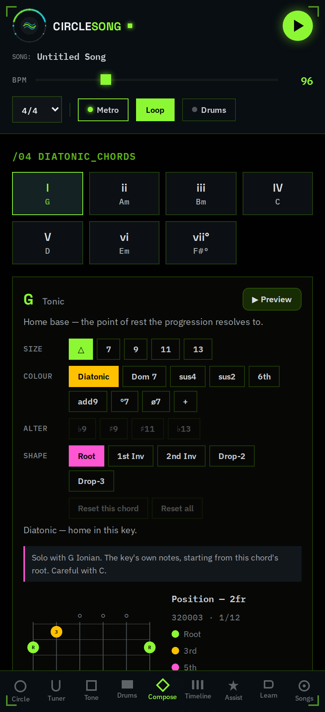
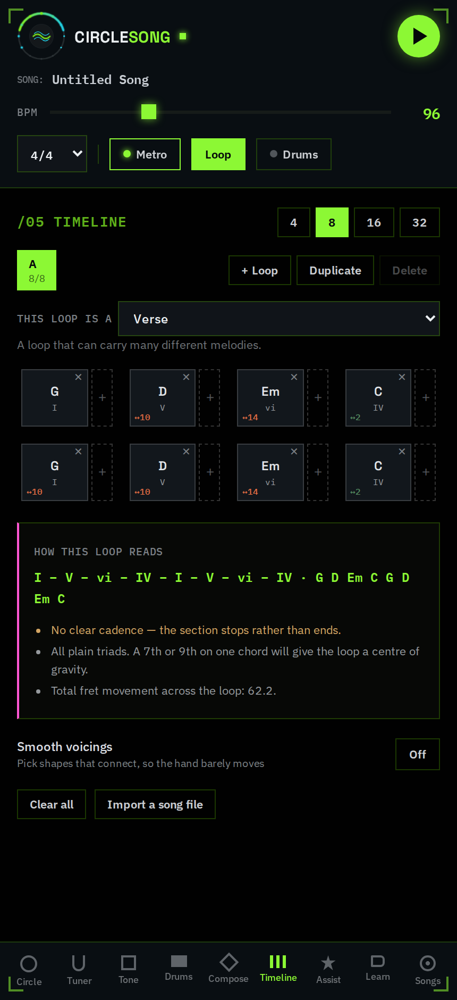
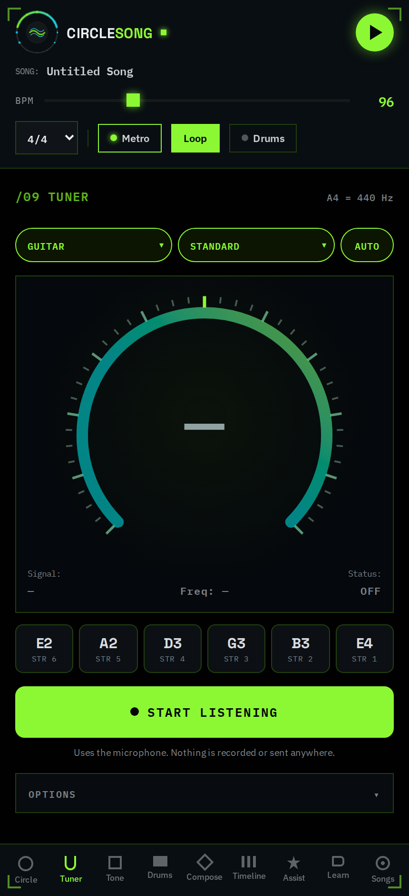

# CircleSong 🎸⭕

> **Turn music theory into song structures.**
> A theory-guided guitar workstation that runs in a browser: compose on the
> Circle of Fifths, hear every chord on a physically modelled guitar, build
> loops into songs, and tune the instrument you are playing — offline, with no
> dependencies and no build step.

by Nicolás Raul Jean-Pierre Figueroa

<p align="center">
  
  
  
  
</p>

---

## Running it

**Easiest — no install, no server.** Download
[`dist/circlesong.html`](dist/circlesong.html) and open it. It is the entire app
in one self-contained file, about 720 KB: no network, no dependencies, fonts and
the audio engine included. Works offline, and works on a phone — the layout is
mobile-first.

**From source**, for development. The app is dependency-free static ES modules,
but in this form it **must be served over HTTP** — ES modules and `AudioWorklet`
both refuse `file://` origins.

```bash
npm start                 # or: npx http-server -p 8080 .
# then open http://localhost:8080
```

Any static server works (`python3 -m http.server 8080`, `npx serve`, nginx…).
There is no build step for development: edit a file, reload the page.

Rebuild the single-file version after changing sources:

```bash
npm run build             # -> dist/circlesong.html, and stamps sw.js
npm run fonts             # refresh assets/fonts.css (needs network; rarely)
npm run icons             # re-render icons/ from assets/logo.svg
```

Requires a browser with `AudioWorklet`: Chrome/Edge 66+, Firefox 76+, Safari 14.1+.

---

## What it does

### Harmony

- **Circle of Fifths engine** — real-time harmonic mapping, mode selection, and
  diatonic chords. The outer ring is major keys, the inner ring their relative
  minors, and each diatonic wedge is marked with its **scale degree** (I, ii,
  iii…) which follows the key as you change it.
- **Extended and altered chords** — five sizes (triad, 7th, 9th, 11th, 13th),
  **nine colours** (diatonic, dominant 7, sus4, sus2, 6th, add9, °7, ø7,
  augmented) and **four alterations** (♭9, ♯9, ♯11, ♭13), per chord and
  resettable per chord. Progressions are stored as *specs* rather than finished
  chords, so `Dm7/9 – E7/9 – Am9` transposes with the key.
- **Secondary dominants** drawn on the wheel as arrows pointing at the chord
  each one pulls into, with a row you can tap to hear the resolution.
- **A harmony engine** (`src/harmony.js`) behind all of it: functional analysis
  (tonic / subdominant / dominant), root-motion strength, next-chord suggestions
  that know what section you are writing, cadence detection, and shortest-path
  voice leading across a progression.
- **Key lock + wheel explorer** — lock the key, then tap any wedge to hear it and
  read how it relates: its degree and function if it belongs, or the interval it
  sits at if it is borrowed. Taps play the key's own chord on that root, or a
  single note, whichever you choose.

### Writing

- **Dynamic fretboard and inversion switcher** — exact fingerings with
  chord-tone colouring, and instant auditioning of root position, 1st and 2nd
  inversion, Drop-2 and Drop-3. Cycle alternative shapes for any chord.
- **Progression timeline** — loops of 4, 8, 16 or 32 bars in **five time
  signatures** (4/4, 3/4, 6/8, 3/8, 12/8). Bars split in half for two chords per
  bar. Every bar can be filled from a picker that suggests what comes next.
- **Multiple loops per song** — verse, chorus, turnaround as separate loops with
  section roles, switchable while playing. A switch waits for the bar line, so
  the change lands on the beat instead of cutting mid-phrase.
- **How this loop reads** — a live analysis of what you have written: roman
  numerals, cadence, and what is missing.
- **Songwriting assistant** — **14 moods**, **6 song sections with 23 variants**,
  and a **library of 56 progressions** in 8 families: pop and rock, modal rock,
  minor keys, jazz, blues, folk and country, jazz and neo-soul, and a set drawn
  from Matney & Niemuth's *Chord Progression Handbook*. Tap a card to hear it in
  your key, Apply to write it to the timeline. Each template carries the mode it
  belongs in, so ♭VII progressions land in Mixolydian rather than being
  mislabelled in Ionian.
- **Saved songs** — save, rename and reopen projects from the Songs tab; they
  live in browser storage, so they survive a reload and work offline. Songs
  written by an older version still import from a file.

### Sound

- **Eight modelled instruments** — acoustic steel, nylon classical, electric
  clean, electric crunch, jazz archtop, reggae, grand piano and electric piano —
  with live control over sustain, brightness and pick position, and **five
  tunings**: Standard, Drop D, DADGAD, Open G and E♭ Standard.
- **34 strum and picking patterns**, 28 for guitar and 6 written for the
  keyboard presets, in families: strumming, muted and percussive, reggae/ska and
  offbeat, jazz comping, Latin and syncopated, country and bluegrass, other
  meters, fingerstyle. Each carries the **tempo range it is written for**, with
  one tap to go there.
- **Feel, Swing and Humanize** — re-time any pattern into double- or half-time,
  set how far the offbeats lean, and how tightly the hand holds the grid.
- **Drum machine with a step sequencer** — 35 grooves across rock, funk and
  soul, house/techno/breakbeat, reggae and soca, Latin, jazz and blues, folk,
  hip-hop and metal. **Six kits, ten voices.** Every groove loads into an
  editable grid — tap a step to cycle it through soft, medium and hard — with
  swing, humanise, a musical **Vary** button, and a playhead driven from the
  audio clock. Locked to the guitar bar for bar in any time signature.
- **A scale strip with its own voices** — play single notes over a running
  progression to work out a line. They cannot be cut by a chord, cannot steal a
  chord's voice, and do not stop when the transport does.
- **Predictable auditioning** — each chord you tap silences the one before it, so
  rapid exploring never turns into overlapping mush. Toggle it off under Tone →
  Playback, and set how much of a bar an audition plays.

### Tuning

- **A real tuner** — YIN pitch detection with parabolic interpolation, an RMS
  noise gate, EMA smoothing and a hysteresis lock, running on the app's own
  AudioContext. The microphone is a dead end by construction: it reaches an
  analyser and nothing else.
- **8 instruments and 26 tunings** — guitar (including Drop C, Open D, DADGAD
  and 7-string), bass, ukulele, mandolin, banjo, violin, cello/viola, and
  chromatic.
- **Reference notes** — tap any string to hear it, loudness-compensated so the
  low E is as audible as the top E, and built from more partials the lower it
  goes because most speakers cannot reproduce an 82 Hz sine at all.
- Auto or manual target, an in-tune chime, adjustable sensitivity, response and
  in-tune window, and reference A4 from 432 to 444 Hz.

### Learning

- **Modes lesson and ear trainer** — play any mode's scale and characteristic
  vamp, see the degree strip showing exactly which notes it alters against the
  major scale, then test yourself with a "guess the mode" quiz that tracks your
  streak.

### Appearance

- **Five themes** — System, Dark, Light, High Contrast and Sepia, chosen under
  Songs → Appearance and remembered. System follows the device and re-resolves
  while the app is running, so a phone that flips to dark at sunset takes the
  app with it.
- Every colour in the app is a semantic token, so a theme is a set of values
  rather than a second stylesheet — including the numbers the circle of fifths
  and the fretboard are painted with, which are drawn from JavaScript and would
  otherwise stay dark on a light page.
- **All four rendered themes pass WCAG AA** on every one of the 461 text
  elements in the app, measured rather than assumed — see Verifying it.

Pressing play with an empty timeline runs the metronome, so you can find a tempo
before committing chords.

Keyboard: <kbd>Space</kbd> toggles playback, <kbd>1</kbd>–<kbd>7</kbd> select and
audition scale degrees. Add `?theme=mono` to the URL for the monochrome amber
accent set.

---

## The sound

Chords are rendered by a **six-string digital waveguide model** (extended
Karplus–Strong) running in an `AudioWorklet`, not by oscillators: fractional
delay tuning with the loop filter's phase delay compensated, frequency-dependent
decay, pick position and hardness, velocity → brightness coupling, sympathetic
bridge coupling between strings, and — for the keyboard presets — a felt hammer
excitation and allpass dispersion that stretches the partials the way a real
piano's stiffness does.

A **pick attack** is played alongside each note rather than through it. An ideal
plucked string's partials fall off at 12 dB/octave, which leaves a low E with
essentially no energy above 1 kHz; the sound of the plectrum itself is where a
strummed steel string's 2–6 kHz comes from.

Each preset then convolves with a modelled instrument body or speaker cabinet.
Those are specified as **resonances in dB and normalised by their average gain
across the audible band**, because a convolution's gain is a property of its
whole impulse response and not of its peak sample — getting that wrong is what
made an F barre chord distort while a C did not.

Strums are performed rather than triggered: sequential string contact, velocity
and timing jitter scaled by the Humanize control, treble-side upstrokes that
catch fewer strings, and real loop damping for palm mutes. Patterns say **which
strings** a stroke catches, **how long** the chord rings in beats before the
fret hand stops it, and whether a stroke is a **dead percussive one** — which is
the difference between a reggae skank and a ska stroke, and between funk and a
series of chords.

See **[docs/AUDIO_QUALITY.md](docs/AUDIO_QUALITY.md)** for the full signal path,
the measurements it is verified against, and the ordered roadmap for pushing it
closer to a recorded guitar.

---

## Verifying it

There is no unit-test suite; the app is checked by **driving the built file in
headless Chromium and measuring what comes out**, because almost everything here
is either audio or layout and a green assertion about neither is worthless. A
check that counts zero of something is treated as a failure, not a pass.

The standing checks cover: WCAG contrast for every visible text element in
every theme; output level, peak and crest factor for every preset
on the chord shapes that stress a guitar body's air mode; that every rhythm
pattern schedules audible strokes in every meter it claims; that ska and reggae
differ in position, ring, strings and mute; pitch-detector accuracy in cents on
every string of every tuning; reference-note loudness across the range; that the
microphone is released when the tab is left; and that the single-file build boots
from `file://`, under a strict CSP, and offline after the service worker has
installed.

---

## Installing on a phone

CircleSong is a PWA, so it installs from the browser — a launcher icon, no
browser chrome, and it keeps working with no signal. No app store, no APK.

**1. Publish it.** [`.github/workflows/pages.yml`](.github/workflows/pages.yml)
deploys the repo to GitHub Pages on every push to `main`. Enable it once at
**Settings → Pages → Source: GitHub Actions**. It is then live at:

```
https://digitalninja-dev.github.io/CircleSong/
```

An origin of its own matters for two reasons beyond tidiness: a service worker
will not install without one, so the PWA cannot go offline, and Permissions
Policy defaults `microphone` to `self`, so the tuner cannot listen inside
somebody else's cross-origin frame no matter what the user allows.

**2. Install it.** On Android, open that URL in Chrome and either take the
**Install** prompt or **⋮ → Add to Home screen**. On iOS, Safari →
**Share → Add to Home Screen**.

Installation needs HTTPS, which Pages provides. To try it on a phone first, run
`npm start` and open your machine's LAN address — the app will run, but Android
only offers to *install* over HTTPS or localhost.

### Testing on a device over USB

With the phone connected and USB debugging on, forward the port so the phone
sees the dev server as localhost, which also satisfies the install requirement:

```bash
adb reverse tcp:8080 tcp:8080
npm start
```

Then open `http://localhost:8080` on the phone. `chrome://inspect` on the desktop
gives you the phone's console and DevTools.

### Updating an installed copy

Nothing to remember: `npm run build` stamps `CACHE` in `sw.js` with a hash of
everything in the cached shell, so shipping a change always invalidates installed
copies. This used to be a hand-written number, and forgetting it looked exactly
like the new feature not working.

---

## The Android app

CircleSong is packaged for Android with [Capacitor](https://capacitorjs.com/),
which wraps the app's own files in a native shell. It needs no server: the whole
app is inside the package, so it works with no signal from the first launch
rather than after a first online visit.

**No Capacitor plugins are used, deliberately.** A plugin would mean a bare
import in the web sources, and the web app's one structural promise is that it
has no runtime dependencies and builds to a single self-contained file. The
native side is configured instead — `capacitor.config.json`, the manifest, and
the theme resources — so `src/` is exactly the same code in the browser and in
the app.

```bash
npm install                # the Capacitor CLI, dev-time only
npm run build:www          # assemble www/ — the files that go in the package
npm run android:sync       # copy them into the native project
npm run android:apk        # -> android/app/build/outputs/apk/debug/*.apk
npm run android:open       # or open the project in Android Studio
```

Building locally needs the **Android SDK** and a JDK 21. If you would rather not
install a toolchain, you do not have to:
[`.github/workflows/android.yml`](.github/workflows/android.yml) builds a debug
APK on every push and attaches it to the run — download it from the Actions tab
and sideload it.

For the Play Store, tag a release (`v1.0.0`) and the same workflow builds a
signed App Bundle, provided four repository secrets exist:
`ANDROID_KEYSTORE_BASE64` (`base64 -w0 your.keystore`), `ANDROID_STORE_PASSWORD`,
`ANDROID_KEY_ALIAS` and `ANDROID_KEY_PASSWORD`. Without them the tag build skips
the bundle rather than failing — an unsigned release is of no use to anyone. The
keystore never enters the repository; `android/app/build.gradle` reads the
signing config from the environment.

### What the app declares, and why

- **`RECORD_AUDIO` and `MODIFY_AUDIO_SETTINGS`** — the tuner. Capacitor's
  WebChromeClient asks for these at the moment `getUserMedia` runs, but a
  runtime request only succeeds if the permission is declared in the manifest
  first.
- **`android.hardware.microphone` is `required="false"`** — everything except
  the tuner works without one, so a device that has no microphone should still
  be offered the app.
- **`androidScheme: "https"`** — the WebView serves the app from
  `https://localhost`, which is a secure context, so the service worker,
  `AudioWorklet` and `getUserMedia` all behave exactly as they do on the web.
- **minSdk 24** (Android 7). `AudioWorklet` needs a Chromium WebView 66 or
  newer, which is a system component updated through the Play Store rather than
  tied to the OS version.

### Alternatively, a PWA

None of the above is required for everyday use. The app installs straight from
the browser — see below — and for a thin Play Store wrapper around the hosted
site, [PWABuilder](https://www.pwabuilder.com/) or Bubblewrap will take the
manifest already in this repo and emit a Trusted Web Activity.

---

## Project layout

```
index.html               app shell / markup
styles.css               cyber-brutalist dark theme
manifest.webmanifest     PWA metadata — name, icons, standalone display
sw.js                    service worker — offline cache of the app shell
assets/logo.svg          brand mark — swap this one file to change the artwork
assets/fonts.css         webfont subsets, inlined so nothing loads from a CDN
icons/                   launcher icons (generated by tools/make-icons.mjs)
src/
  app.js                 state, rendering, and event wiring
  theory.js              pitch classes, modes, diatonic harmony, chord specs
  fretboard.js           tunings, voicing search, inversions, voice leading
  harmony.js             functional analysis, suggestions, secondary dominants
  patterns.js            strum, fingerpicking and keyboard patterns
  drum-patterns.js       drum grooves as step grids, by genre and metre
  sequencer.js           lookahead transport, feel, metronome, playhead
  tuner.js               YIN pitch detection, instrument tunings, reference tones
  theme.js               resolving, storing and applying the five themes
  projects.js            saved songs in browser storage
  content.js             harmonic-function copy, mode lessons, progressions
  audio/
    engine.js            AudioContext, presets, signal chain, strum performance
    guitar-processor.js  AudioWorklet — ten string models
    impulse.js           synthesised body, cabinet, and room impulse responses
    drums.js             synthesised drum kit voices
capacitor.config.json    native shell config — app id, web directory, scheme
android/                 the Android project (Capacitor); build output ignored
tools/
  build-single.mjs       bundles everything into dist/circlesong.html
  build-www.mjs          assembles www/ — the files the Android package ships
  fetch-fonts.mjs        regenerates assets/fonts.css (inlined webfont subsets)
  make-icons.mjs         renders icons/ from assets/logo.svg
docs/
  AUDIO_QUALITY.md       sound design notes and improvement roadmap
  screenshots/           the images at the top of this file
.github/workflows/
  pages.yml              deploys to GitHub Pages on push to main
  android.yml            builds the APK, and a signed bundle on a tag
dist/
  circlesong.html        generated single-file build — do not edit by hand
```

### Branding

The brand mark lives at `assets/logo.svg` and is referenced by the header and the
About panel. Replace that one file to change the artwork — the build inlines it
as a `data:` URI automatically, so `dist/circlesong.html` stays self-contained.

---

## Repo settings

These live in GitHub's own settings rather than in the tree, so they have to be
set by hand — **Settings → General**, and the **About** panel on the repo home
page.

**Description**

```
Theory-guided guitar workstation in the browser: compose on the Circle of Fifths, hear it on a physically modelled guitar, sequence loops into songs, and tune your instrument. Zero dependencies, installable, works offline.
```

**Website**: `https://digitalninja-dev.github.io/CircleSong/`

**Topics**: `music` `music-theory` `guitar` `daw` `circle-of-fifths` `web-audio`
`audioworklet` `physical-modeling` `pwa` `offline-first` `chord-progressions`
`tuner` `javascript` `no-dependencies`

---

## Licence

CircleSong is free software under the
[GNU Affero General Public License v3](LICENSE) or later, with no warranty.

Because it runs as a web application, **section 13** applies: anyone who
interacts with it over a network must be offered the corresponding source of the
version they are using. The app does that with a "Source Code (AGPL v3.0)" link
in its About panel and its footer. If you deploy a modified copy, point that link
at your source. See [NOTICE](NOTICE).
